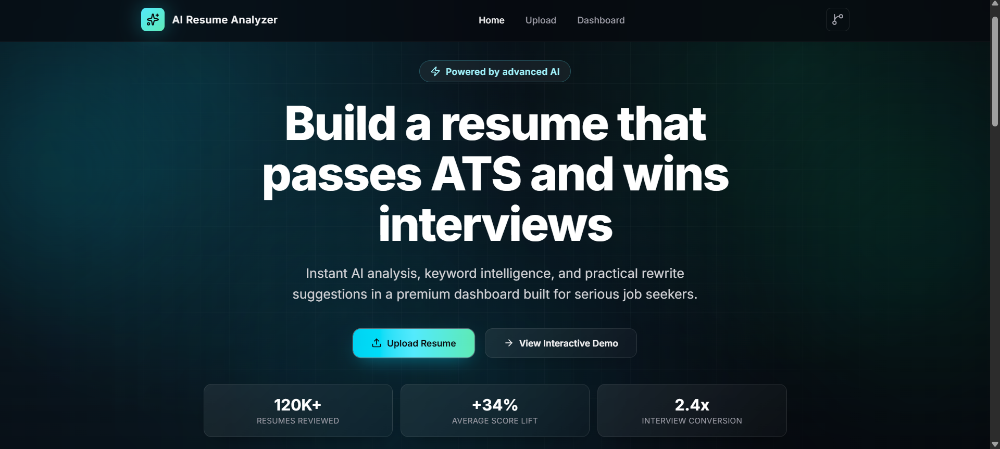
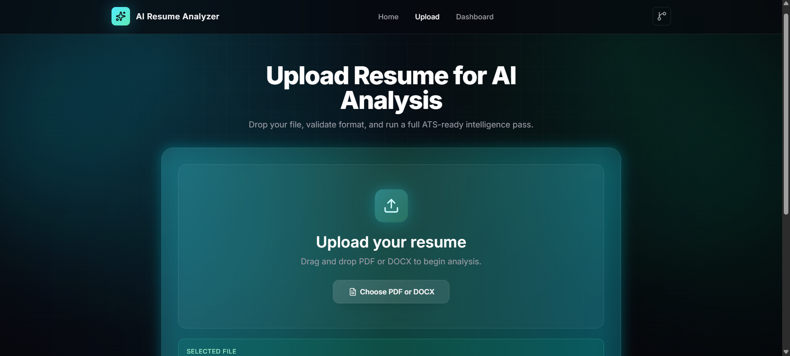
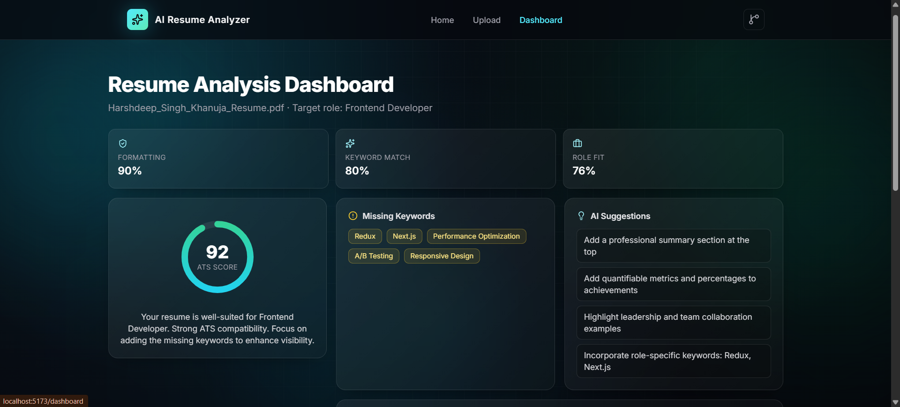

# AI Resume Analyzer

An AI-powered Resume Analyzer that evaluates resumes for ATS (Applicant Tracking System) compatibility using Google Gemini AI. Upload a PDF or DOCX resume and receive detailed feedback, ATS scoring, keyword analysis, strengths, and improvement suggestions.

## Features

- Upload PDF and DOCX resumes
- Resume text extraction and parsing
- ATS Score Analysis
- Formatting Evaluation
- Keyword Match Detection
- Resume Strength Identification
- AI-Powered Improvement Suggestions
- Skills Match Analysis
- Modern Responsive UI
- Interactive Dashboard
- Animated User Experience

## Tech Stack

### Frontend

- React.js
- Vite
- Tailwind CSS
- Framer Motion
- React Router

### Backend

- Node.js
- Express.js
- Multer
- PDF Parse
- Mammoth

### AI Integration

- Google Gemini API

## Screenshots

### Home Page



### Upload Page



### Dashboard



### Clone Repository

```bash
git clone https://github.com/harsh-dsk/ai-resume-analyzer.git
cd ai-resume-analyzer
```

### Frontend Setup

```bash
npm install
npm run dev
```

Frontend runs at:

```text
http://localhost:5173
```

### Backend Setup

```bash
cd server
npm install
npm start
```

Backend runs at:

```text
http://localhost:5000
```

## Environment Variables

Create a file named `.env` inside the `server` folder.

```env
GEMINI_API_KEY=your_gemini_api_key
PORT=5000
CLIENT_ORIGIN=http://localhost:5173
```

## Project Structure

```text
ai-resume-analyzer/
│
├── src/
│   ├── components/
│   ├── pages/
│   ├── sections/
│   ├── services/
│   └── data/
│
├── server/
│   ├── routes/
│   ├── services/
│   ├── middleware/
│   └── index.js
│
├── public/
├── README.md
└── package.json
```

## How It Works

1. User uploads a resume (PDF/DOCX)
2. Backend extracts text from the document
3. Resume content is sent to Gemini AI
4. AI analyzes:
   - ATS Compatibility
   - Formatting Quality
   - Keyword Relevance
   - Resume Strengths
   - Improvement Suggestions
5. Results are displayed in an interactive dashboard

## Future Improvements

- User Authentication
- Resume History Storage
- Firebase/MongoDB Integration
- Job Description Matching
- Resume Version Tracking
- Downloadable Analysis Reports
- Cover Letter Analysis

## Learning Outcomes

This project demonstrates:

- Full Stack Development
- REST API Integration
- AI API Usage
- File Upload Handling
- PDF Parsing
- Prompt Engineering
- Responsive UI Design
- React State Management

## Author

**Harshdeep Singh Khanuja**

GitHub:
https://github.com/harsh-dsk

## License

This project is developed for educational and portfolio purposes.
